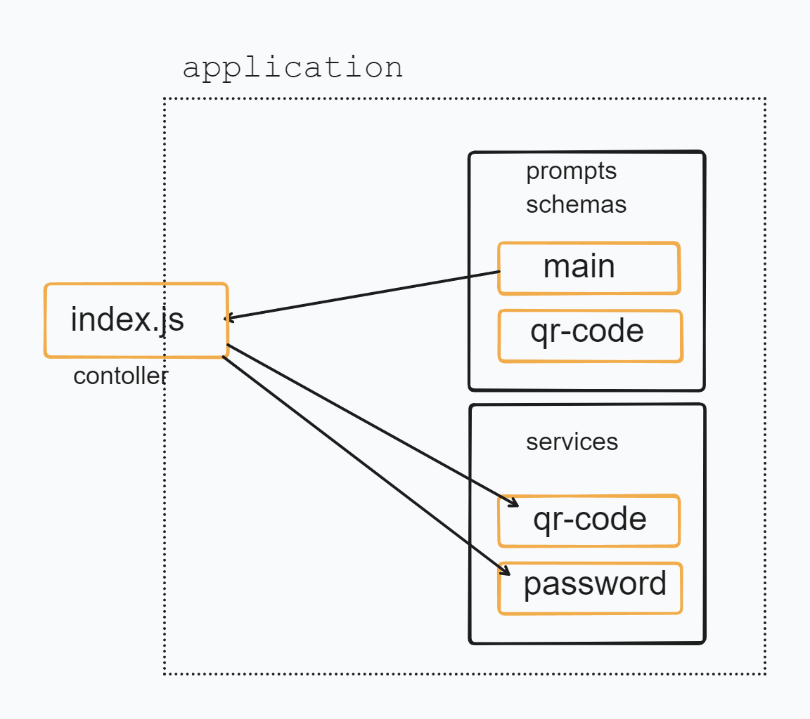

# Gerador de QRCODE e PASSWORD para e-commerce
A ideia é um gerador de QRCODE, TOKEN ou número e letras aleatórios

## Quem sou?

<!--  -->
<table align="center">
<thead>
  <tr>
    <td>
        <p align="center">TI | E-commerce</p>
        <a href="https://github.com/leodario">
        <br>
        <sub>@leodario-junior</sub>
      </a>
    </td>
    <td colspan="3">
    <p>Desenvolvendo soluções E-commerce | TI</p>
      <a 
      href="https://www.linkedin.com/in/leodario-junior/" 
      align="center">
           
        </a>
    </td>
  </tr>
</thead>
</table>
<!--  -->

## Arquitetura do projeto


## Iniciando o projeto
```
npm init -y
```
## Baixando pacote prompt
Recuperar dados no prompt 
[https://www.npmjs.com/package/prompt](https://www.npmjs.com/package/prompt)

## Instalando
```
npm i prompt
```
## Estilizando o texto no prompot
[https://www.npmjs.com/package/chalk](https://www.npmjs.com/package/chalk)
Instalando dependência do chalk
```
npm i chalk
```
## Baixando o pacote do QRCODE
[https://www.npmjs.com/package/qrcode-terminal](https://www.npmjs.com/package/qrcode-terminal)
Instalando dependência do qrcode-terminal
```
npm i qrcode-terminal
```
## Gerando Password